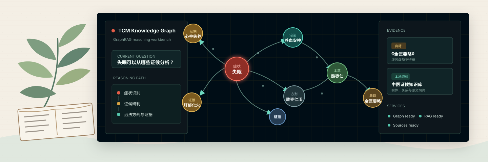
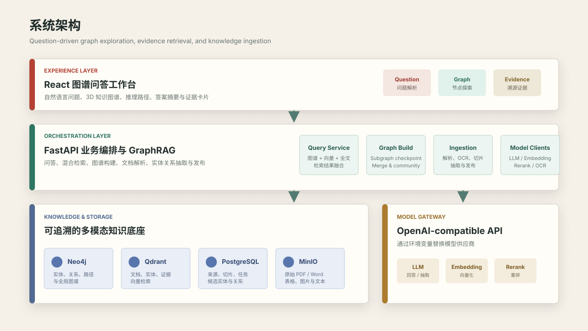

<div align="center">
  

  <h1>TCM Knowledge Graph Platform</h1>

  <p><strong>中医知识图谱与 GraphRAG 智能问答平台</strong></p>
  <p>把症状、证候、治法、方剂、中药与典籍证据，组织成可检索、可探索、可追溯的知识网络。</p>

  <p>
    
    
    
    
    
  </p>

  <p>
    <a href="#about">About</a> ·
    <a href="#features">核心能力</a> ·
    <a href="#architecture">系统架构</a> ·
    <a href="#quick-start">快速开始</a> ·
    <a href="#ingestion">知识入库</a> ·
    <a href="#development">开发指南</a>
  </p>
</div>

---

<a id="about"></a>

## About

TCM Knowledge Graph Platform 是一个面向中医知识组织、检索与可视化推理的全栈平台。它不是一个只返回文字的通用聊天界面，而是以知识图谱为主视觉，将每一个结论尽可能还原为：

```text
问题 -> 实体识别 -> 图谱路径 -> 混合检索 -> 证据溯源 -> 答案生成
```

项目同时包含两条相互独立、又能协同工作的主线：

- **图谱问答工作台**：面向演示、查询与知识探索，展示答案、关系路径和原始证据。
- **知识摄取与构建系统**：面向知识管理，负责文件解析、切片、抽取、校验、子图构建与发布。

> [!NOTE]
> 项目定位为中医知识工程、检索研究与产品演示平台，不替代专业医疗诊断或治疗建议。

<a id="features"></a>

## 核心能力

| 能力 | 说明 |
| --- | --- |
| 图谱驱动问答 | 从自然语言问题中识别意图与实体，组织症状 -> 证候 -> 治法 -> 方药 -> 典籍路径。 |
| 3D 知识探索 | 基于 `Three.js` 与 `3d-force-graph` 展示全局图谱、高亮推理路径并支持节点交互。 |
| GraphRAG 检索 | 融合图谱检索、全文检索、向量检索、重排与社区摘要。 |
| 证据可追溯 | 答案与原始切片、典籍、本地文档和图谱关系建立关联。 |
| 多格式文档入库 | 支持 PDF、DOCX、Markdown、TXT、CSV、JSON 和图片类来源，可配置 OCR。 |
| 可恢复图谱构建 | 按数据源保存 subgraph checkpoint，支持全局图合并、阶段标记和异步构建任务。 |
| 模型接入可替换 | 通过 OpenAI-compatible API 分别配置 LLM、Embedding、Rerank 和 OCR 模型。 |
| 本地稳定演示 | 未配置外部模型时使用内置演示路径，便于快速启动与展示。 |

<a id="architecture"></a>

## 系统架构

<div align="center">
  
</div>

| 层级 | 主要技术 | 职责 |
| --- | --- | --- |
| 交互层 | React 18, TypeScript, Vite, Ant Design, Three.js | 问题输入、3D 图谱、答案、证据和运行状态 |
| 服务层 | FastAPI, Pydantic, SQLAlchemy | 问答编排、GraphRAG、文档摄取、图谱发布与任务管理 |
| 数据层 | Neo4j, Qdrant, PostgreSQL, MinIO | 图数据、向量索引、元数据与原始文件存储 |
| 模型层 | OpenAI-compatible APIs | 回答生成、结构化抽取、嵌入、重排与 OCR |

<a id="quick-start"></a>

## 快速开始

### 1. 环境要求

- Docker 24+
- Docker Compose v2
- 可选：一组 OpenAI-compatible 模型 API 凭据

### 2. 启动全部服务

```bash
cp .env.example .env
docker compose up -d
```

### 3. 打开服务

| 服务 | 地址 |
| --- | --- |
| Web 工作台 | <http://localhost:3000> |
| API 健康检查 | <http://localhost:8000/api/health> |
| Neo4j Browser | <http://localhost:7474> |
| Qdrant | <http://localhost:6333> |
| MinIO Console | <http://localhost:9001> |
| PostgreSQL | `localhost:5432` |

### 4. 体验演示问题

```text
失眠可以从哪些证候分析？
柴胡桂枝干姜汤适合什么情况？
党参有什么功效？
```

首次启动会下载容器镜像并安装前后端依赖。即使没有配置真实 LLM Key，项目也会保留可操作的本地演示结果。

### 配置模型

编辑 `.env`：

```env
LLM_BASE_URL=https://your-llm-provider.example/v1
LLM_API_KEY=your-real-api-key
LLM_MODEL=your-model-name

EMBEDDING_MODEL=Qwen/Qwen3-Embedding-8B
RERANK_MODEL=Qwen/Qwen3-Reranker-8B
OCR_MODEL=deepseek-ai/DeepSeek-OCR
```

重启 API 使配置生效：

```bash
docker compose restart tcm-api
```

<a id="ingestion"></a>

## 知识入库

上游入库链路将原始资料统一转换为文档切片、候选实体、候选关系、证据与可发布图谱：

```text
原始文件
  -> MinIO 对象存储
  -> 文档解析 / OCR / 结构化切片
  -> PostgreSQL 来源、任务、切片与候选知识
  -> 按来源构建 subgraph checkpoint
  -> 合并全局图并生成社区摘要
  -> Neo4j 关系图 + Qdrant 向量索引
  -> 问答系统检索与引用
```

上传并发布一份文档：

```bash
SOURCE_ID=$(
  curl -s http://localhost:8000/api/ingestion/upload \
    -F "file=@./data/import/demo.txt;type=text/plain" \
  | python -c "import json,sys; print(json.load(sys.stdin)['source_id'])"
)

JOB_ID=$(
  curl -s http://localhost:8000/api/ingestion/jobs \
    -H 'Content-Type: application/json' \
    -d "[\"$SOURCE_ID\"]" \
  | python -c "import json,sys; print(json.load(sys.stdin)['job_id'])"
)

curl -s -X POST "http://localhost:8000/api/ingestion/jobs/$JOB_ID/run"
curl -s http://localhost:8000/api/ingestion/publish \
  -H 'Content-Type: application/json' \
  -d "[\"$SOURCE_ID\"]"
```

构建或恢复 GraphRAG 全局图：

```bash
curl -s -X POST http://localhost:8000/api/retrieval/graphrag/build \
  -H 'Content-Type: application/json' \
  -d '{}'
```

<a id="development"></a>

## 开发指南

### 项目结构

```text
.
├── frontend/               # React + TypeScript 图谱工作台
├── backend/                # FastAPI API 与核心服务
│   ├── app/api/            # 问答、图谱、检索和入库 API
│   └── app/services/       # GraphRAG、抽取、发布与存储适配
├── data/                   # 种子数据、导入文件与中间产物
├── scripts/                # 导入、重建、同步与审计脚本
├── docs/                   # 设计文档与 README 视觉素材
├── compose.yml             # 本地全栈编排
└── Makefile                # 测试快捷命令
```

### 测试

```bash
make test
```

也可分别执行：

```bash
make test-backend
make test-frontend
```

### 初始化种子图谱

```bash
python scripts/build_seed_artifacts.py
python scripts/import_seed_graph.py
```

## API 概览

| 方法 | 路径 | 用途 |
| --- | --- | --- |
| `POST` | `/api/query` | 提交中医问题并获取答案、图谱与证据 |
| `GET` | `/api/graph/overview` | 读取图谱总览 |
| `GET` | `/api/retrieval/status` | 查看检索引擎状态 |
| `POST` | `/api/retrieval/graphrag/build` | 同步构建 GraphRAG 全局图 |
| `POST` | `/api/retrieval/graphrag/build/async` | 创建异步构建任务 |
| `POST` | `/api/ingestion/upload` | 上传知识源文件 |
| `POST` | `/api/ingestion/jobs` | 创建解析与抽取任务 |
| `POST` | `/api/ingestion/publish` | 发布验证后的知识产物 |

API 启动后可访问 <http://localhost:8000/docs> 查看完整 OpenAPI 文档。

## Roadmap

- [x] 图谱驱动的问答与证据展示
- [x] 3D 知识图谱总览与路径高亮
- [x] PDF / DOCX / Markdown / TXT / CSV / JSON 文档摄取
- [x] RAGFlow-compatible 混合检索与 GraphRAG 构建主干
- [x] 子图 checkpoint、全局图合并与社区摘要
- [ ] 知识审核、冲突处理与版本对比界面
- [ ] 更完整的中医术语规范化与同义实体消歧
- [ ] 面向知识库的评测集、可观测性与持续集成

## 贡献

建议在提交修改前先运行 `make test`。新增图谱实体或关系时，请同步提供来源、证据切片与对应测试，保持知识链路可追溯。

---

<div align="center">
  <sub>Built for traceable TCM knowledge exploration and GraphRAG research.</sub>
</div>
